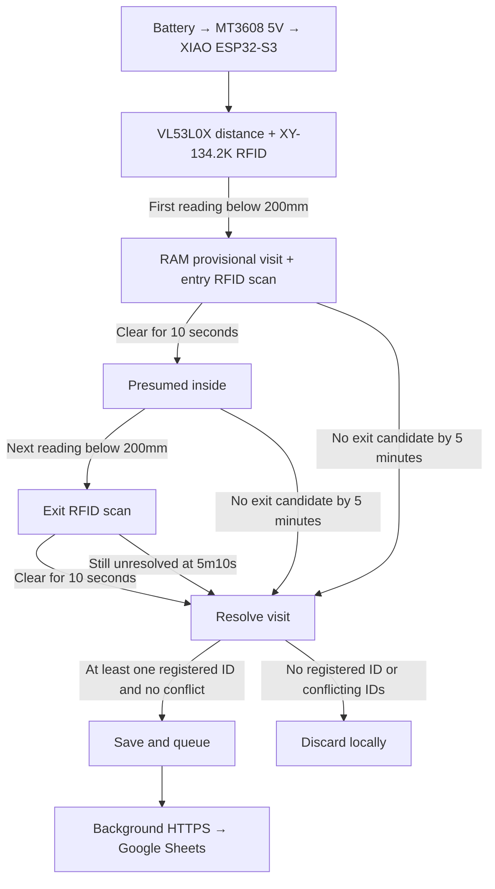

# Smart Litter Cabinet

[繁體中文版](README.zh-TW.md)

An event-monitoring system built around the Seeed Studio XIAO ESP32-S3. It combines VL53L0X distance sensing, XY-134.2K RFID identification, and Google Apps Script/Sheets to record litter-cabinet visits.

The current design uses RFID and ToF. Camera-based recognition is an archived experiment; its data-capture utilities and trained Edge Impulse model remain available for reference.

## How it works

## Structure

- `firmware/main/`: main RFID + VL53L0X + Apps Script Arduino sketch
- `firmware/tests/`: isolated hardware validation sketches and records
- `backend/`: Google Sheets Apps Script receiver
- `hardware/`: component sourcing, power design, wiring diagram, and measured RFID range
- `experiments/vision/`: archived camera capture workflow, local Flask collector, and Edge Impulse model; its Arduino sketch is under `esp32_camera_stream/`

## Security

Sensitive configuration is injected locally: `secrets.example.h` defines the interface, while ignored `secrets.h` files provide deployment values. Device credentials, raw identity values, and image datasets are managed separately from source control.

## Status

- Main system: the revised event logic still requires hardware validation; compilation and simulation do not establish real cat-visit accuracy.
- Debug dashboard: the optional LAN page retains timestamped scan and upload logs with full chip IDs and cat names, alongside live distance and UART status. See [firmware debugging](firmware/main/README.md).
- RFID identification: distance creates a RAM-only provisional visit. Either the entry or exit scan can attach one of the two registered cats; no identity or conflicting identities are discarded, never uploaded as `unknown`. See [firmware rules](firmware/main/README.md).
- VL53L0X: standalone web distance test is under `firmware/tests/`
- RFID: a 130mm coil reads the implanted 2×12mm FDX-B chip at approximately 10–13cm in the installed test environment
- Vision: archived and not part of the current MVP
