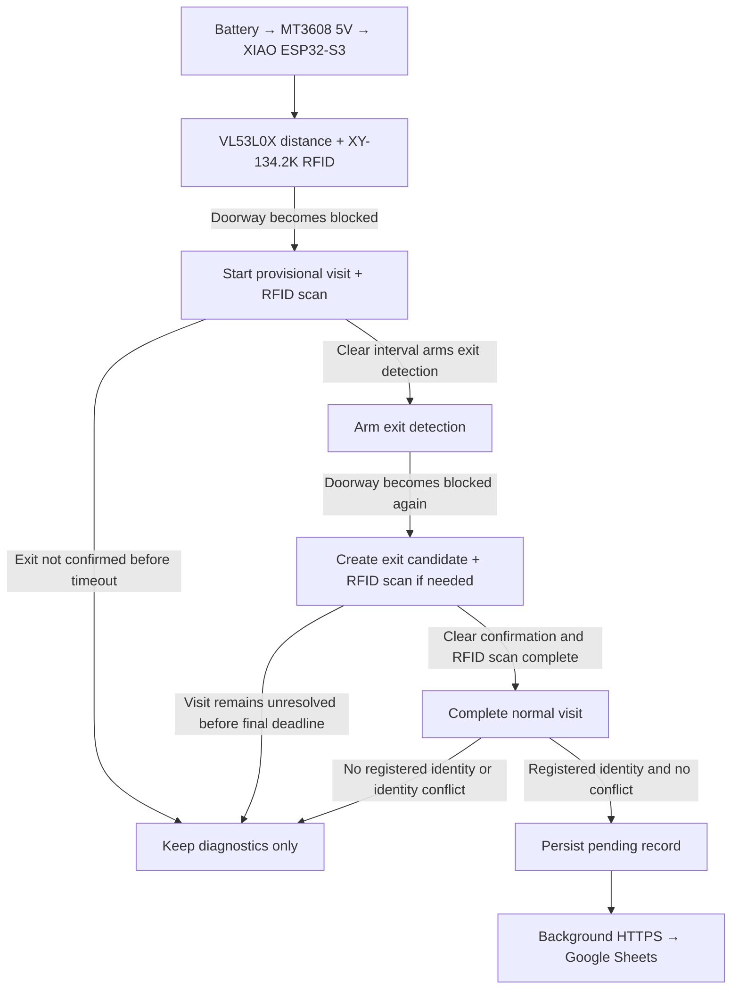

# Smart Litter Cabinet

[繁體中文版](README.zh-TW.md)

A litter-cabinet visit monitor built around the Seeed Studio XIAO ESP32-S3. The main system uses VL53L0X distance sensing for doorway detection, XY-134.2K RFID for cat identification, and Google Apps Script/Sheets for visit records.

Camera-based recognition remains under `experiments/vision/` as an archived experiment and does not participate in the current visit-detection flow.

## How it works

Production thresholds and timing are defined in `firmware/main/app_config.h` and are intentionally not duplicated here. The recorded duration is the interval between the first doorway blockage and the second blockage that creates the exit candidate; RFID and network wait time are not added.

## Structure

- `firmware/main/`: production RFID + VL53L0X firmware
- `firmware/tests/`: isolated hardware and state-machine validation tools
- `backend/`: Google Apps Script receiver for Google Sheets
- `hardware/`: sourcing, power, wiring, and measured RFID range
- `experiments/vision/`: archived camera/TinyML experiment

## Current behavior

- VL53L0X uses separate idle and active ranging periods defined in `app_config.h`.
- RFID is powered only during scan windows and turns off after a registered tag is read or the configured scan timeout expires.
- Only normal visits with one registered identity and no identity conflict are uploaded. Timeout or unresolved visits remain in diagnostics and are not written to Sheets.
- The firmware opens configurable maintenance windows at boot and after each event for status, diagnostics, pending uploads, and Web OTA.
- A 130 mm RFID coil has read the implanted 2×12 mm FDX-B tags at approximately 10–13 cm in the installed test environment.
- Visit-detection accuracy, RFID read rate, and battery life depend on cabinet geometry, tag orientation, RF conditions, and power quality and should be verified on the installed hardware.

## Security

Copy each `secrets.example.h` to a local `secrets.h` and keep deployment values out of source control. Device tokens, Wi-Fi credentials, raw chip IDs, and image datasets are not intended to be committed.
