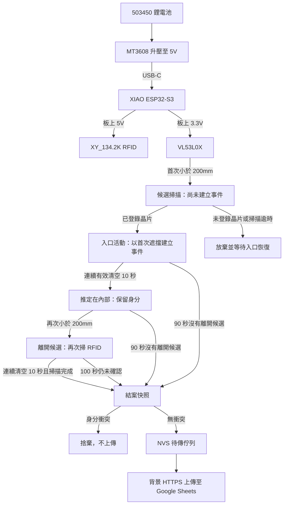

# 貓砂櫃智慧偵測系統

[README.md](README.md)

以 Seeed Studio XIAO ESP32-S3 為主控，結合 VL53L0X 距離偵測、XY-134.2K RFID 身分識別與 Google Apps Script/Sheets 記錄貓咪使用貓砂櫃的事件。

目前主線是 RFID + ToF；相機影像辨識為已驗證、暫停發展的實驗方案，仍保留資料收集工具與 Edge Impulse 模型。

## 運作流程

## 目錄

- `firmware/main/`：主系統 Arduino sketch（RFID + VL53L0X + Apps Script）
- `firmware/tests/`：單一硬體驗證程式與紀錄
- `backend/`：Google Sheets Apps Script 接收端
- `hardware/`：硬體採購、電源設計、接線圖與 RFID 實測資料
- `experiments/vision/`：已歸檔的 ESP32 拍照流程、本機 Flask 收圖工具與 Edge Impulse 模型；Arduino sketch 位於 `esp32_camera_stream/`

## 安全

敏感設定採本機注入，以 `secrets.example.h` 定義介面、`secrets.h` 承載實值，並由 `.gitignore` 排除於版本控制。設備憑證、身分識別原始值與影像資料集皆與原始碼倉庫分離管理。

## 狀態

- 主系統：事件判定修訂的實機驗證仍待進行；編譯與模擬不代表已驗證貓咪真實進出。
- 除錯頁：區域網路頁面保留掃描與上傳的時間序列 log，顯示完整晶片 ID、貓咪、即時距離及 UART 狀態；詳見[主韌體除錯說明](firmware/main/README.md)。
- RFID 辨識：只有本機已登錄的兩隻貓能建立事件；未登錄晶片立即拒絕，入口漏讀不建立紀錄，正式事件的離開漏讀保留原身分。完整規則見 [主韌體說明](firmware/main/README.md)。
- VL53L0X：獨立網頁測距程式已收入 `firmware/tests/`
- RFID：130mm 線圈在實際環境中可隔著貓咪皮膚讀取 2×12mm FDX-B 晶片，實測距離約 10–13cm
- Vision：歸檔，現階段不繼續開發
