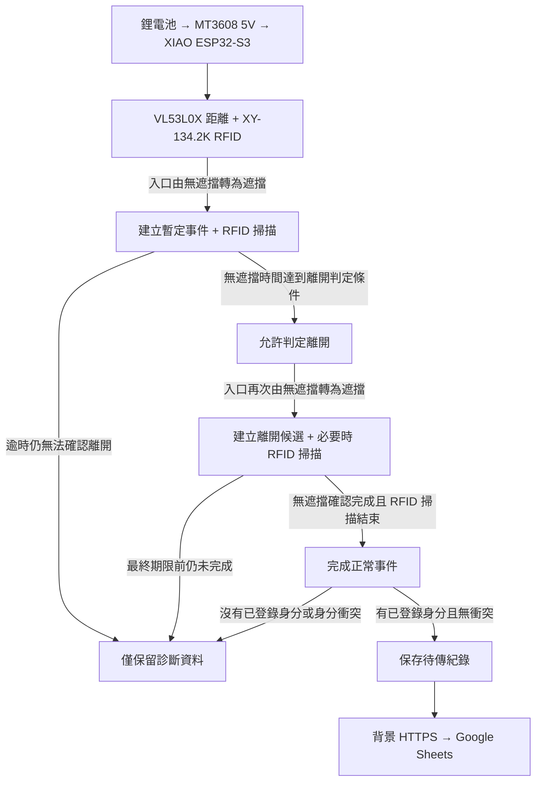

# 貓砂櫃智慧偵測系統

[English README](README.md)

以 Seeed Studio XIAO ESP32-S3 為主控，使用 VL53L0X 偵測入口、XY-134.2K RFID 辨識貓咪，並透過 Google Apps Script/Sheets 記錄使用事件。

目前主系統使用 RFID + ToF；相機影像辨識保留在 `experiments/vision/`，屬已歸檔實驗，不參與目前的進出判定。

## 運作流程

正式韌體的門檻與時間參數統一定義在 `firmware/main/app_config.h`，README 不重複目前數值。停留時間以第一次入口遮擋到建立離開候選的第二次遮擋計算，不包含 RFID 或網路等待時間。

## 目錄

- `firmware/main/`：正式 RFID + VL53L0X 韌體
- `firmware/tests/`：硬體與狀態機的獨立驗證工具
- `backend/`：Google Sheets Apps Script 接收端
- `hardware/`：採購、供電、接線與 RFID 實測資料
- `experiments/vision/`：已歸檔的相機／TinyML 實驗

## 目前行為

- VL53L0X 的待機與事件中測距週期由 `app_config.h` 分別定義。
- RFID 只在掃描期間供電；讀到已登錄晶片或達到設定的掃描逾時即關閉。
- 只有正常離開、辨識到單一已登錄貓咪且沒有身分衝突的事件會上傳。逾時或無法確定身分的事件僅保留診斷資料，不寫入 Google Sheets。
- 開機與每次事件結束後會依設定進入維護模式，提供狀態、診斷、待傳資料上傳與 Web OTA。
- 130 mm 線圈在目前安裝測試環境中，讀取皮下 2×12 mm FDX-B 晶片的實測距離約 10–13 cm。
- 進出判定準確度、RFID 讀取率與續航會受櫃體結構、晶片方向、RF 環境及供電影響，應以實機測試結果為準。

## 安全

將各資料夾的 `secrets.example.h` 複製為本機 `secrets.h`，部署值不要提交進 Git。裝置 token、Wi-Fi 密碼、原始晶片 ID 與影像資料集都應留在版本控制之外。
