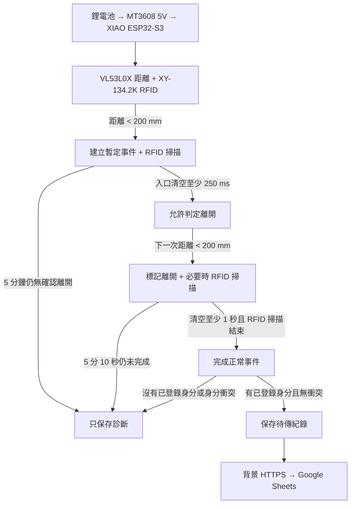

# 貓砂櫃智慧偵測系統

[English README](README.md)

以 Seeed Studio XIAO ESP32-S3 為主控，結合 VL53L0X 距離偵測、XY-134.2K RFID 身分識別與 Google Apps Script/Sheets，記錄貓咪使用貓砂櫃的事件。

目前正式路徑是 RFID + ToF；相機影像辨識保留在 `experiments/vision/`，屬已歸檔實驗，不參與目前的進出判定。

## 運作流程

停留時間以「第一次入口遮擋」到「標記離開的第二次遮擋」計算，不把 RFID 或網路等待時間算進去。

## 目錄

- `firmware/main/`：正式 RFID + VL53L0X 韌體
- `firmware/tests/`：硬體與 state machine 的獨立驗證工具
- `backend/`：Google Sheets Apps Script 接收端
- `hardware/`：採購、供電、接線與 RFID 實測資料
- `experiments/vision/`：已歸檔的相機／TinyML 實驗

## 目前行為

- 待機時 VL53L0X 每 200 ms 測距，事件期間每 100 ms 測距。
- RFID 只在掃描窗口供電；讀到已登錄晶片或 10 秒掃描逾時即關閉。
- 只有正常離開、辨識到單一已登錄貓咪且沒有身分衝突的事件會上傳。逾時或無法確定身分的事件只保留診斷，不寫入 Sheet。
- 開機與每次事件結束後會開啟維護窗口，提供狀態、診斷、待傳資料上傳與 Web OTA。
- 130 mm 線圈在目前安裝測試環境中，讀取皮下 2×12 mm FDX-B 晶片的實測距離約 10–13 cm。
- 真實辨識率與續航仍取決於櫃體幾何、晶片方向、RF 環境與供電狀況，需以最終實機驗證為準。

## 安全

將各資料夾的 `secrets.example.h` 複製為本機 `secrets.h`，部署值不要提交進 Git。Device token、Wi-Fi 密碼、原始晶片 ID 與影像資料集都應留在版本控制之外。
